# QuickShop-Hikari 项目架构报告

> 生成自 codebase-analyzer｜分析时间：2026-08-16｜分析模式：采样分析（663 个 Java 文件，>500 判定为大型项目）
> 所有论断均附 `文件:行号` 证据。路径缩写：`QS/` = `quickshop-bukkit/src/main/java/com/ghostchu/quickshop/`，`API/` = `quickshop-api/src/main/java/com/ghostchu/quickshop/api/`。

---

## 1. 项目快照

| 项 | 值 |
|---|---|
| 项目名 | quickshop-hikari `6.3.0.0-SNAPSHOT-6`（根 pom.xml:9） |
| 类型 | Minecraft Paper 服务端商店插件（AGPL/GPL v3 双许可，pom.xml:100-111） |
| 语言/JDK | Java 21（pom.xml:16） |
| 构建 | Maven 多模块 + Takari Lifecycle + Shade 重定位（pom.xml:163-418） |
| 目标平台 | 仅 Paper（Spigot 已拒绝启动，QS/QuickShopBukkit.java:243-252）；Folia 兼容（plugin.yml `folia-supported: true`） |
| 代码规模 | 663 个 Java 文件（api 177 / bukkit 357 / addon 62 / compat 52 / common 12 / platform 3） |
| 测试 | **0 个测试**（无 src/test、无 @Test、无 surefire/jacoco 配置） |
| 贡献者 | Ghost_chu (12215 commits)、sandtechnology (1109)、creatorfromhell (180) 等，GitHub Actions + Mergify 自动化 |
| 分支策略 | 单主干 `hikari`（+维护分支 `cleanup`），PR 合并经 Mergify |

---

## 2. Maven 多模块架构

### 2.1 模块依赖图

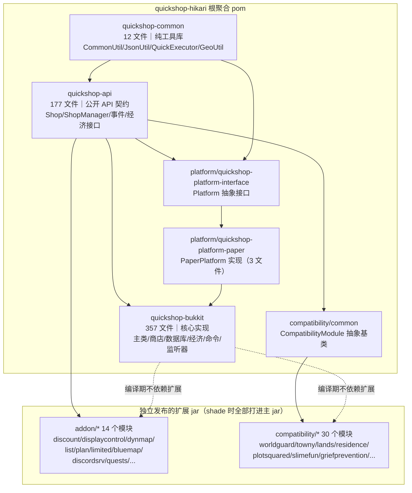

依赖证据：quickshop-api/pom.xml 依赖 `quickshop-common`；quickshop-bukkit/pom.xml 依赖 `quickshop-api` 与 `quickshop-platform-paper`；platform-interface 依赖 `quickshop-common`。全部模块在根 pom.xml:472-524 的 `<modules>` 中聚合，Shade 插件（pom.xml:196-228）把 `com.ghostchu.quickshop.addon:*`、`com.ghostchu.quickshop.compatibility:*` 一并打进最终 fat-jar。

### 2.2 模块职责表

| 模块 | 文件数 | 角色 | 关键内容 |
|---|---|---|---|
| quickshop-common | 12 | 基础设施层（无 Bukkit 依赖） | `QuickExecutor`（6 个线程池，QuickExecutor.java:13-36）、`JsonUtil`、`CommonUtil`、`GeoUtil`（镜像测速） |
| quickshop-api | 177 | 公开契约层 | `Shop`、`ShopManager`、`EconomyProvider`、40+ 个自定义事件（api/event/）、`CommandManager`、`InventoryWrapper` |
| platform | 3 | 平台适配层 | `Platform` 接口（Platform.java）→ `PaperPlatform`（注册命令、物品编解码、SLF4J Logger） |
| quickshop-bukkit | 357 | 核心实现层 | 主类 `QuickShop`（1447 行）、`ContainerShop`、`SimpleShopManager`、数据库、经济、命令、监听器 |
| addon/* | 62 | 官方功能扩展 | 折扣码、地图标记（dynmap/bluemap/squaremap/pl3xmap）、Discord、排行、迁移器 |
| compatibility/* | 52 | 第三方插件兼容 | 30 个区域保护/天空岛/物品插件的集成桥（全部继承 `CompatibilityModule`） |

### 2.3 构建管线（Maven Shade）

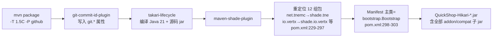

---

## 3. 技术栈全景

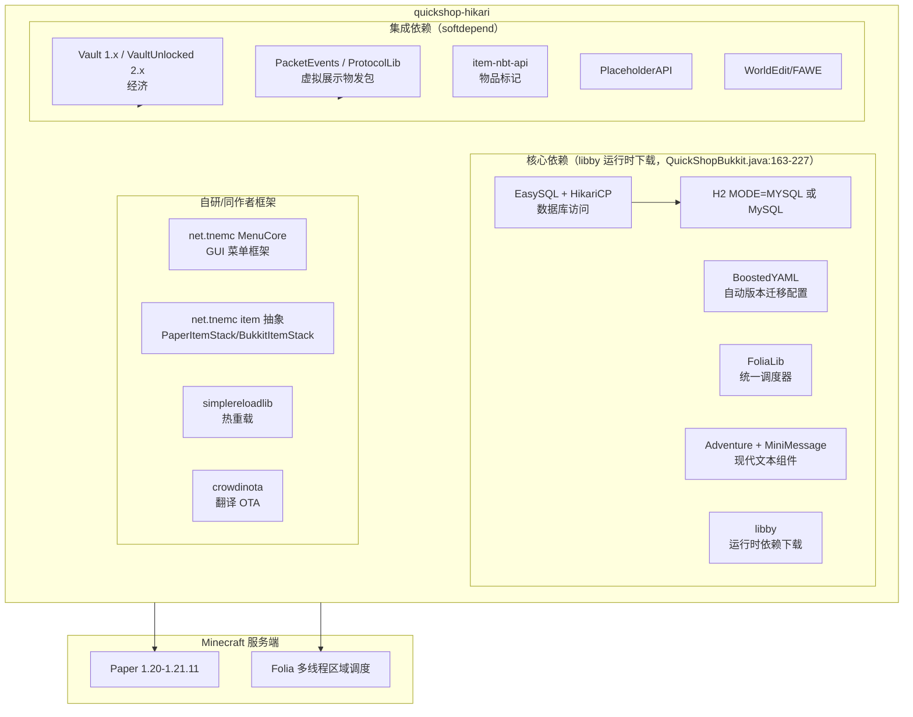

---

## 4. quickshop-bukkit 包结构全景（357 文件）

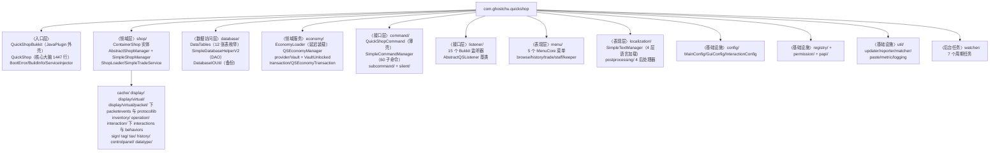

各包文件数佐证：`find quickshop-bukkit -type d`（54 个包目录）；`ShopLoader.java:47-454`、`ContainerShop.java`（约 1900 行）、`SimpleShopManager.java:107-1632`。

---

## 5. 运行时组件架构（QuickShop 主类管理器集群）

`QuickShop` 类（QS/QuickShop.java:181）实现 `QuickShopAPI` 接口，是**服务定位器核心**，聚合 40+ 个管理器字段（字段声明见 QuickShop.java:184-350）：

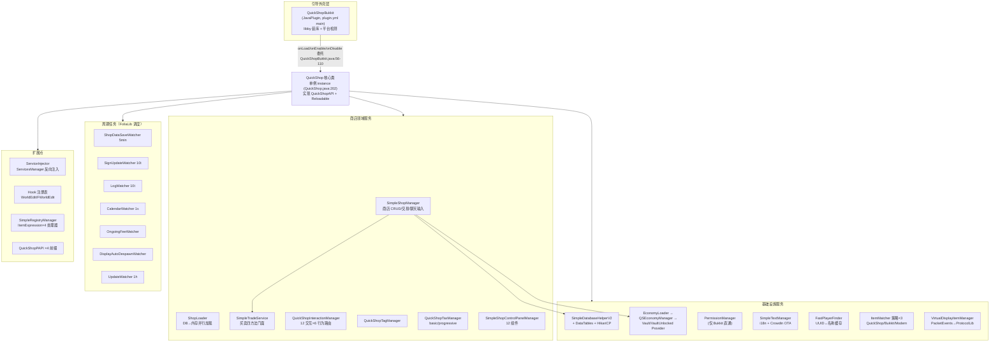

### 5.1 服务清单（节选 25 项，全部 40+ 项见 QuickShop.java:184-350 字段区）

| 服务字段 | 类 | 初始化点 | 职责 |
|---|---|---|---|
| shopManager | SimpleShopManager | QuickShop.java:834 | 商店增删查/交易/聊天价格输入 |
| shopLoader | ShopLoader | :847 | DB 并行加载商店进内存查找表 |
| databaseHelper | SimpleDatabaseHelperV2 | :1201 | 12 张表 DAO + 迁移链 |
| sqlManager | SQLManagerImpl (EasySQL) | :1184/1195 | SQL 执行器（虚拟线程池） |
| economyManager | QSEconomyManager | :222 | 多经济 provider 注册表 |
| economyLoader | EconomyLoader | :221 | 延迟 1 tick 装载 Vault 系（:869） |
| textManager | SimpleTextManager | :515 | 4 层语言文件加载 |
| permissionManager | PermissionManager (static) | :824 | 权限检查（仅 BUKKIT 提供者） |
| interactionManager | QuickShopInteractionManager | :855 | 交互类型→行为映射 |
| itemMatcher | 三选一策略 | :912-922 | 物品匹配比对 |
| virtualDisplayItemManager | VirtualDisplayItemManager | :932 | 数据包假实体展示 |
| rankLimiter | SimpleRankLimiter | :837 | 按权限组限制商店数量 |
| playerFinder | FastPlayerFinder | :430 | UUID↔玩家名缓存 |
| sentryErrorReporter | RollbarErrorReporter | :903 | 错误上报（带隐私审查） |
| updateManager | UpdateManager | :1103 | Modrinth/Nexus 更新源 |

---

## 6. 核心域类图

> 说明：类图中接口以 `<<interface>>` 标注；`Shop` 的 API 完整签名为泛型 `Shop<P, L>`（价格/位置泛型），图中省略泛型参数。

### 6.1 商店领域（API 接口 vs 实现）

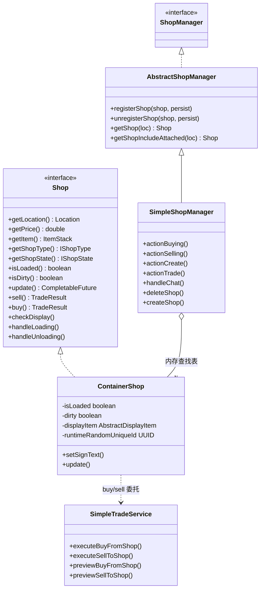

两级继承的注释证据：AbstractShopManager.java:55 *“extract from SimpleShopManager because it is too big”*。`ContainerShop.buy/sell` 委托 TradeService：ContainerShop.java:303、:1671。

### 6.2 库存事务（命令模式 + 快照回滚栈）

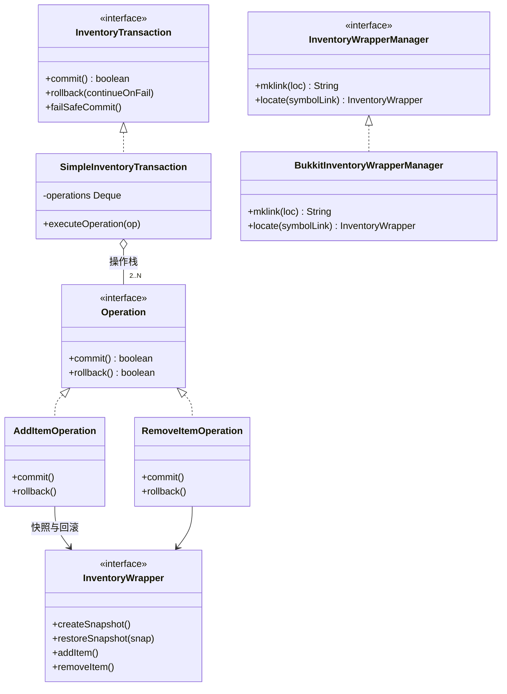

证据：SimpleInventoryTransaction.java:24-269（commit :69-88，rollback :189-221）；AddItemOperation.java:42-65；BukkitInventoryWrapperManager.java:85-101（mklink）。

### 6.3 经济子系统

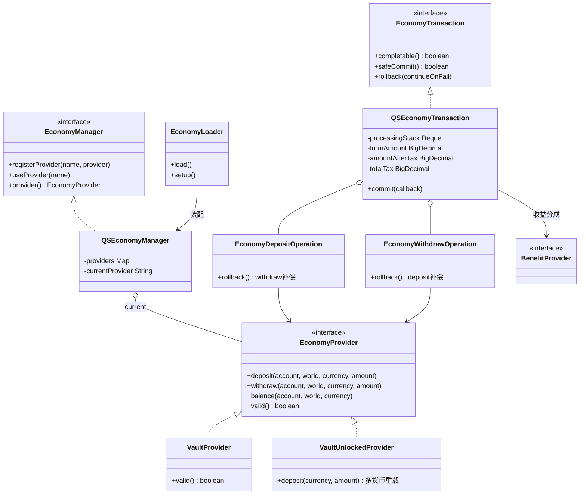

证据：QSEconomyManager.java:37-99；VaultProvider.java:46；EconomyLoader.java:53-118；QSEconomyTransaction.java:54（processingStack）、:79-124（税计算）、:389-460（commit）。**本版本无 TNE/MixedEconomy 旧抽象**，仅 Vault 系双实现。

### 6.4 展示子系统（数据包虚拟物品）

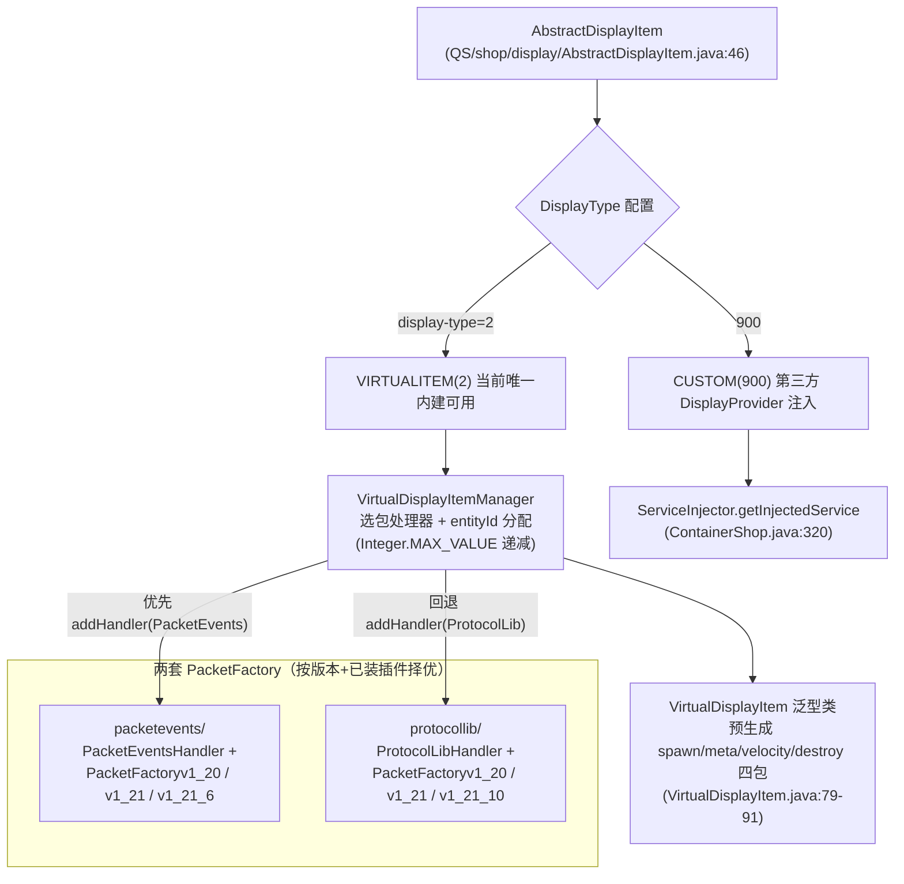

> 事实澄清：枚举中 `REALITEM(0)/ARMORSTAND(1)/ENTITY_DISPLAY(3)` 已被注释禁用，当前仅 VIRTUALITEM 与 CUSTOM 可用（API/shop/display/DisplayType.java）。

### 6.5 交互路由子系统（数据驱动策略）

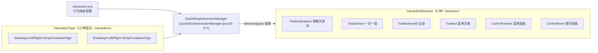

### 6.6 持久化架构（三表分离 + 数据行去重）

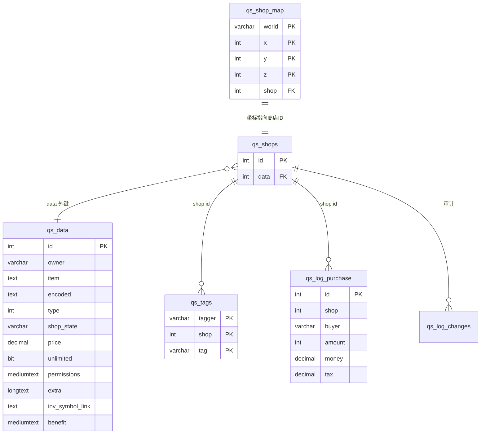

12 张表全表清单见 `QS/database/DataTables.java:25-178`：DATA/SHOPS/SHOP_MAP/MESSAGES/METADATA/PLAYERS/EXTERNAL_CACHE/LOG_PURCHASE/LOG_TRANSACTION/TAGS/LOG_CHANGES/LOG_OTHERS。**数据行去重设计**：`updateShop` 先 `queryDataId` 按字段查重（SimpleDatabaseHelperV2.java:921-941），存在则复用 data id（:884-888），多个商店可共享同一 data 行。

---

## 7. 扩展点架构（Addon / Compatibility / SPI）

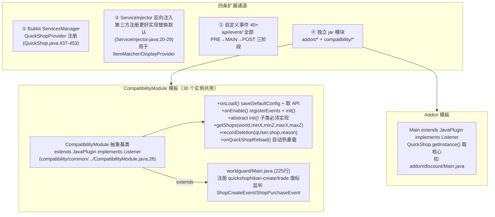

---

## 8. 关键设计模式清单（含证据）

| 模式 | 应用位置 | 证据 |
|---|---|---|
| **单例 + 门面** | `QuickShop.instance` + `QuickShop.folia()/menu()` 静态门面 | QuickShop.java:202,390-398 |
| **服务定位器** | `ServiceInjector.getInjectedService()` 经 Bukkit ServicesManager 查第三方替代实现 | ServiceInjector.java:20-29；用于 ItemMatcher（QuickShop.java:921）、DisplayProvider（ContainerShop.java:320） |
| **双阶段引导** | QuickShopBukkit（libby+平台检测）→ QuickShop（业务初始化） | QuickShopBukkit.java:272-277 |
| **策略** | ItemMatcher 三选一（config `matcher.work-type`）；平台三套 MenuHandler；税 basic/progressive | QuickShop.java:914-920 |
| **命令模式（Operation 栈）** | 经济 Operation（Deposit/Withdraw）与库存 Operation（Add/Remove）均 commit→push→rollback LIFO | QSEconomyTransaction.java:529-557；SimpleInventoryTransaction.java:154-221 |
| **观察者（三阶段事件）** | shopType/shopState/setItem 等全部 PRE→MAIN(可取消)→POST | ContainerShop.java:1007-1024 |
| **模板方法** | AbstractQSListener 统一 register/unregister + 自动热重载；watcher 统一 start/stop | AbstractQSListener.java:9-28 |
| **注册表** | SimpleRegistryManager（ItemExpression×4）；DataTables 表枚举工厂 | QuickShop.java:424-425；DataTables.java:226-294 |
| **Builder** | CommandContainer、QSEconomyTransaction、SimpleInventoryTransaction、ShopMetricRecord | API/command/CommandContainer.java:27-53 等 |
| **延迟初始化** | 经济系统延后 1 tick（等 Vault 注册）+ ServiceRegisterEvent 监听重试 | QuickShop.java:866-869；EconomySetupListener.java:9-21 |
| **优雅降级** | BootError：环境检查失败不崩溃，保留 /qs 显示错误 | QuickShop.java:469-480,530-537 |
| **数据驱动配置** | interaction.yml 决定交互→行为映射 | QuickShopInteractionManager.java:242-277 |

---

## 9. 函数级调用链示例（购买一组商品）

```
PlayerListener.onClick(PlayerInteractEvent)                    QS/listener/PlayerListener.java:87
 ├─ searchShop(block, player)                                   PlayerListener.java:137
 ├─ interactionManager.interaction(event, click)                QuickShopInteractionManager.java:201
 ├─ interactionManager.behavior(type) → TradeDirect             QuickShopInteractionManager.java:144
 └─ TradeDirect.handle → ShopUtil.buyFromShop                   util/ShopUtil.java:270→294
     └─ SimpleShopManager.actionSelling                         SimpleShopManager.java:561
         ├─ 权限/自交易检查                                      :566-574
         ├─ taxManager.provider().calculateTax                   :591-594
         ├─ ShopPurchaseEvent (可取消)                           :597-603
         ├─ QSEconomyTransaction.builder().build()               :606-622
         ├─ transaction.completable() 余额预检                   :624
         ├─ shop.sell → SimpleTradeService.executeBuyFromShop   ContainerShop.java:1667 → SimpleTradeService.java:64
         │   ├─ previewBuyFromShop 预检                          SimpleTradeService.java:259-321
         │   └─ SimpleInventoryTransaction.failSafeCommit        :121
         │       ├─ RemoveItemOperation(箱) + AddItemOperation(背包)
         │       └─ 失败→rollback LIFO→restoreSnapshot           SimpleInventoryTransaction.java:189-221
         ├─ transaction.safeCommit() 经济转账                    QSEconomyTransaction.java:370-474
         │   ├─ EconomyWithdrawOperation(买家)
         │   ├─ EconomyDepositOperation(店主/受益人分成)
         │   └─ checkTax → EconomyDepositOperation(税号)          :462-477
         ├─ sendPurchaseSuccess 收据                              SimpleShopManager.java:977-990
         ├─ ShopSuccessPurchaseEvent                             :671
         │   └─ MetricListener.onPurchase → insertMetricRecord   MetricListener.java:92-110
         └─ notifyBought → 店主离线消息（异步）                   :1174-1203
```

> 跨层调用标注：ShopUtil（util 层）→ SimpleShopManager（领域层）→ TradeService/EconomyTransaction（领域服务）→ VaultProvider（外部集成），共 4 层；异步点 3 处（物品过户在方块线程调度、指标写库在虚拟线程、通知在 cachedThreadPool）。

---

## 10. 架构总评

1. **六边形倾向的插件架构**：quickshop-api 定义端口（Shop/Economy/Inventory/Interaction），quickshop-bukkit 提供适配器，第三方通过 ServicesManager/SPI 注入替代实现——扩展性设计成熟。
2. **并发模型复杂但自洽**：主线程（交易）+ Folia 区域线程（方块操作）+ 虚拟线程（SQL）+ work-stealing（保存/档案 IO），通过 FoliaLib 调度器统一（QuickShop.folia()）。
3. **一致性靠补偿而非锁**：经济/库存都是「快照 + Operation 栈 + LIFO 回滚」，数据库无行锁，审计依赖 qs_log_transaction 事后对账——适合插件生态但要求 safeCommit 纪律（所有业务入口确实统一走 safeCommit，见 04 报告分析）。
4. **技术债**：SimpleShopManager 1632 行已被拆出 AbstractShopManager 仍在膨胀；QuickShop 主类 1447 行承担服务定位器+装配器双职责；零测试覆盖是最大风险点（详见 03/04 报告）。
