# QuickShop-Hikari 运行原理报告

> 生成自 codebase-analyzer｜分析时间：2026-08-16
> 路径缩写：`QS/` = `quickshop-bukkit/src/main/java/com/ghostchu/quickshop/`，`API/` = `quickshop-api/src/main/java/com/ghostchu/quickshop/api/`。

---

## 1. 双阶段引导总览

QuickShop 采用「**胖壳 + 大脑**」双阶段引导：`QuickShopBukkit`（JavaPlugin 外壳）负责依赖装载与平台检测，`QuickShop`（核心类）负责全部业务装配。

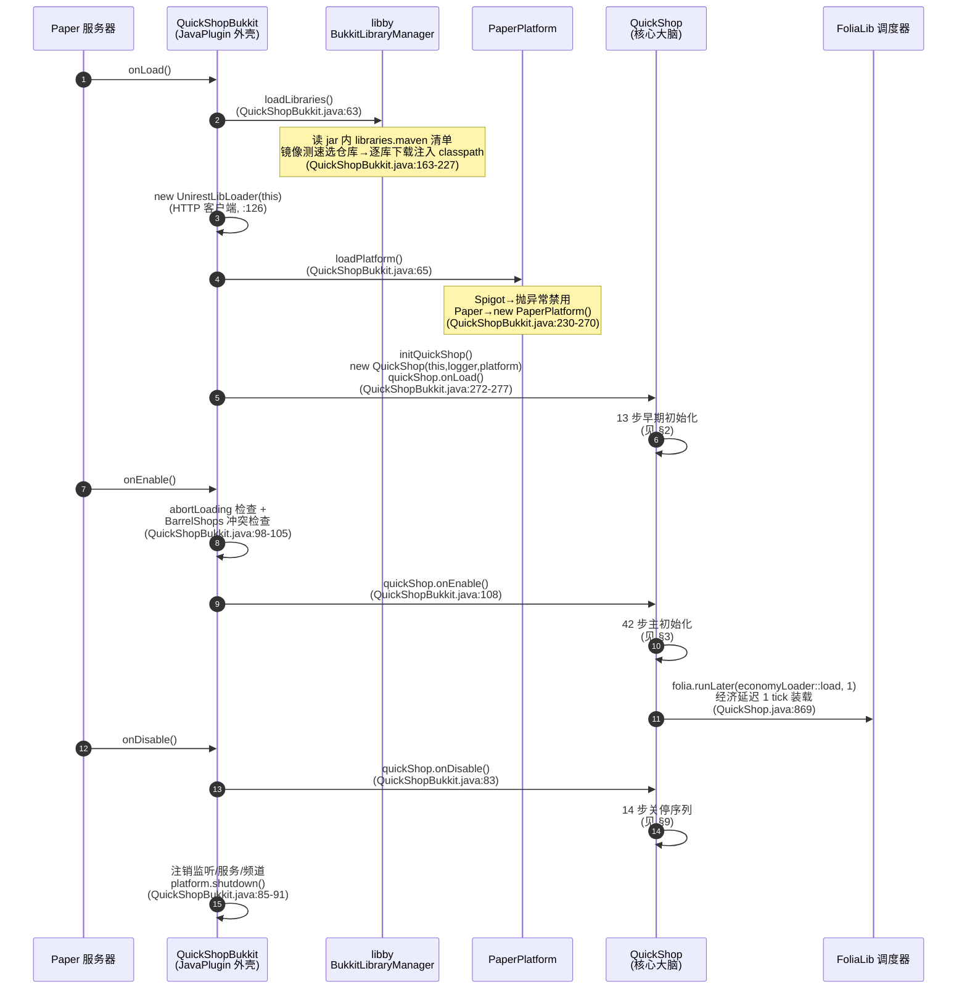

**Bootstrap.java 的真实身份**：`bootstrap/Bootstrap.java:13-34` 只是双击 jar 时的 Swing 弹窗提示（"QuickShop is a Paper plugin"），被设为 Shade 后 Manifest 主类（根 pom.xml:301）以防用户误执行。真正的引导在 `QuickShopBukkit`。

---

## 2. onLoad() 早期启动序列（QuickShop.java:403-435）

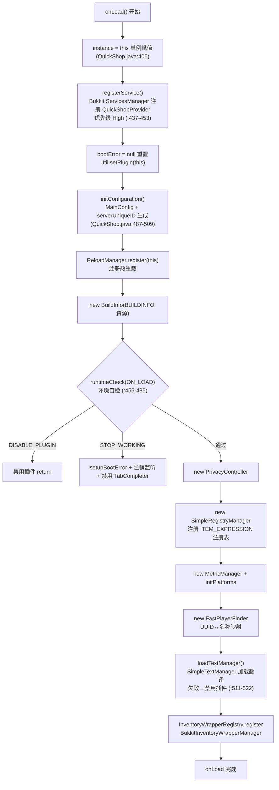

---

## 3. onEnable() 主初始化序列（QuickShop.java:755-885）

42 步完整序列按阶段分组：

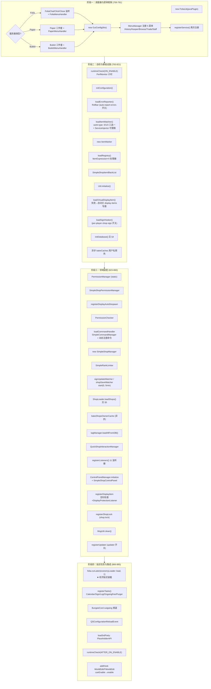

**为什么经济延迟 1 tick**：给 Vault 等经济插件在 ServicesManager 注册的时间窗口；另有 `EconomySetupListener` 监听 `PluginEnableEvent` 在任何插件启用时重试 `economyLoader.load()`（QS/listener/EconomySetupListener.java:16-21），双保险解决加载顺序问题。

---

## 4. 数据库初始化（setupDatabase, QuickShop.java:1162-1212）

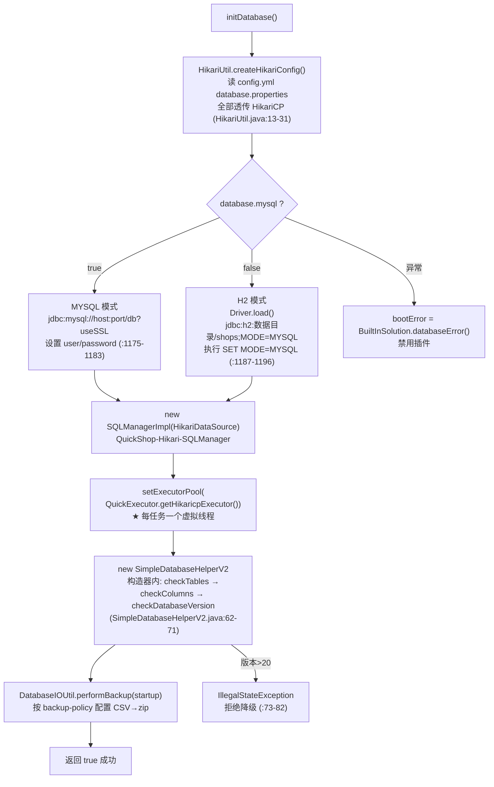

连接池默认参数（config.yml:296-308）：maxPoolSize=10、connectionTimeout=60s、prepStmtCache=250。

### 4.1 数据库版本迁移链（DatabaseUpgrade.upgrade, SimpleDatabaseHelperV2.java:1053-1163）

```mermaid
flowchart LR
    V3["版本 ≤3<br/>抛异常不支持"] --> V8["<9<br/>purgeIsolated<br/>清孤立数据"]
    V8 --> V10["9→10<br/>加 benefit 列"]
    V10 --> V11["10→11<br/>players 表加 cachedName"]
    V11 --> V12["11→12<br/>UUID 字段扩 VARCHAR(128)"]
    V12 --> V13["12→13<br/>全表转 utf8mb4"]
    V13 --> V14["13→14<br/>world 扩到 255"]
    V14 --> V15["14→15<br/>log_purchase 建 3 索引"]
    V15 --> V16["15→16<br/>强制 zip 备份"]
    V16 --> V19["16/17/18→19<br/>加 encoded 列"]
    V19 --> V20["16-19→20<br/>加 shop_state 列<br/>旧 type=2 迁为 state"]
```

> 每步迁移前 `fastBackup()` 先执行 `performBackup("database-upgrade")`（:187-195）。全新库直接写版本 20（:88-90）。

---

## 5. 商店加载流程（ShopLoader.java:77-141）

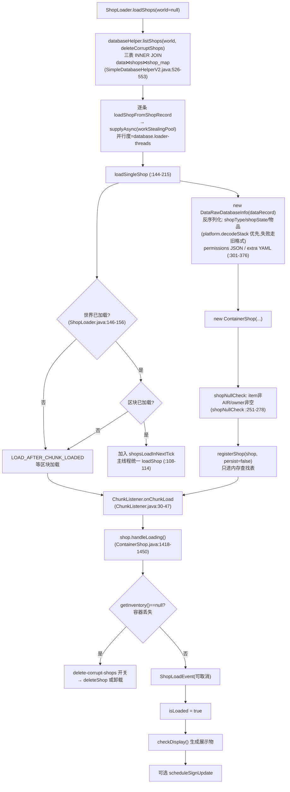

内存查找表结构：`Map<world, Map<ShopChunk, Map<Location, Shop>>>`（AbstractShopManager.java:71），配合 Guava Cache 3 分钟过期（SimpleShopCache.java:46）三级查找。

---

## 6. 玩家交互识别流程（点击 → 行为）

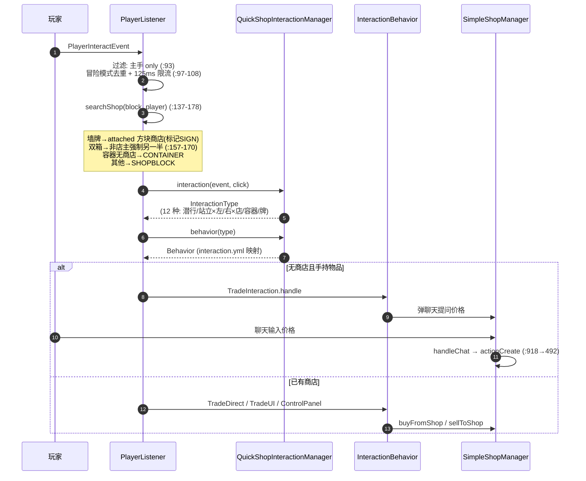

---

## 7. 核心数据路径一：购买交易（actionSelling）

### 7.1 完整时序图

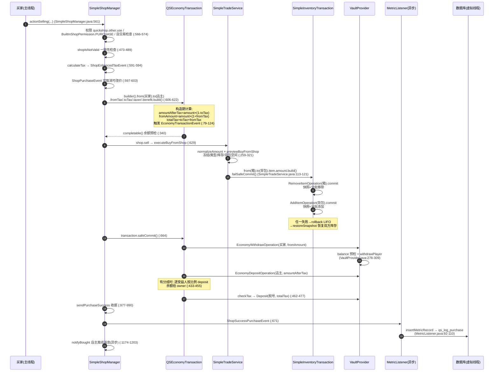

### 7.2 变量级数据变换表（购买 64 个钻石 @ 10 元/个，税率 5% 场景）

| 步骤 | 变量 | 类型 | 值/状态变化 | 代码位置 |
|------|------|------|------------|---------|
| 入口 | `amount` | `int` | `64`（一组，TradeDirect 固定 1 stack） | ShopUtil.java:294 |
| 税计算 | `TaxRates` | `TaxRates` | `{from: 0.05, to: 0.05}`（basic provider 输出） | SimpleShopManager.java:591 |
| 组装交易 | `amount` | `BigDecimal` | `64 × 10 = 640.00` | SimpleShopManager.java:616-622 |
| 构造期 | `amountAfterTax` | `BigDecimal` | `640 × 0.95 = 608.00` | QSEconomyTransaction.java:93-97 |
| 构造期 | `toTax` | `BigDecimal` | `640 - 608 = 32.00` | :99 |
| 构造期 | `fromAmount` | `BigDecimal` | `640 × 1.05 = 672.00`（fromTax=0 时即 640） | :102-106 |
| 库存预检 | `TradePreview` | `TradePreview` | `{ok: true, matchStock: 64, matchSpace: 64}` | SimpleTradeService.java:259-321 |
| 库存过户 | `snapshot` | `Object` | 箱/背包各一份不可变快照 | RemoveItemOperation.java:42 |
| 经济提交 | `processingStack` | `Deque<Operation>` | `[Withdraw(买家,672)] → push → +[Deposit(店主,608)]` | QSEconomyTransaction.java:549 |
| 审计 | `ShopMetricRecord` | bean | `{buyer, type: PURCHASE_BUYING_SHOP, amount: 64, money: 640, tax: 32}` | SimpleDatabaseHelperV2.java:480-502 |
| 离线消息 | `content` | `String(JSON)` | 序列化收据入 qs_message 表 | MsgUtil |
| 复杂度 | — | — | 查找 O(1)（哈希表）；库存计数 O(n)（遍历槽位） | Util.countItems |

### 7.3 库存事务提交/回滚状态机

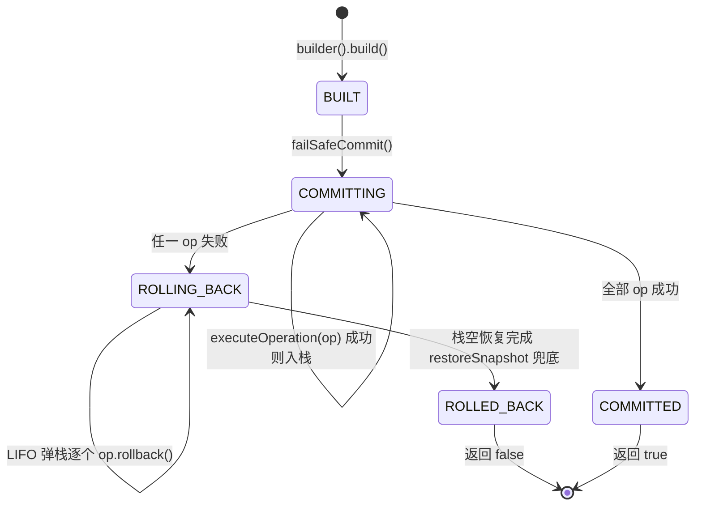

证据：SimpleInventoryTransaction.java:69-88（commit）、:154-163（failSafeCommit 触发 rollback）、:189-221（LIFO 弹栈 + 快照恢复）。

### 7.4 经济事务状态机（含已知缺陷标注）

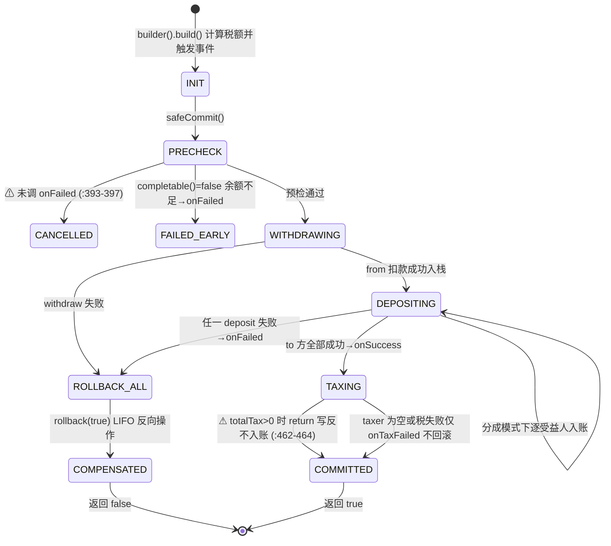

> ⚠ 两处疑似缺陷（代码现状）：`checkTax` 守卫条件 `if(totalTax > 0) return;`（QSEconomyTransaction.java:464）与注释意图相反；`onCommit` 取消分支未调用 `callback.onFailed`（:393-397）。静态分析结论，实际影响需结合调用方确认。

---

## 8. 商店对象状态机

### 8.1 类型 × 状态双轴（ContainerShop.java:998-1024, 1173-1176）

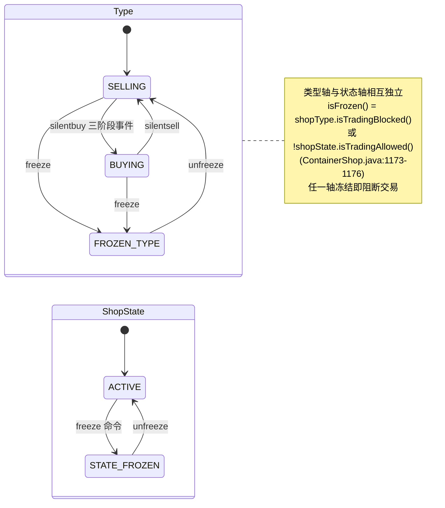

### 8.2 持久化生命周期（脏标记机制）

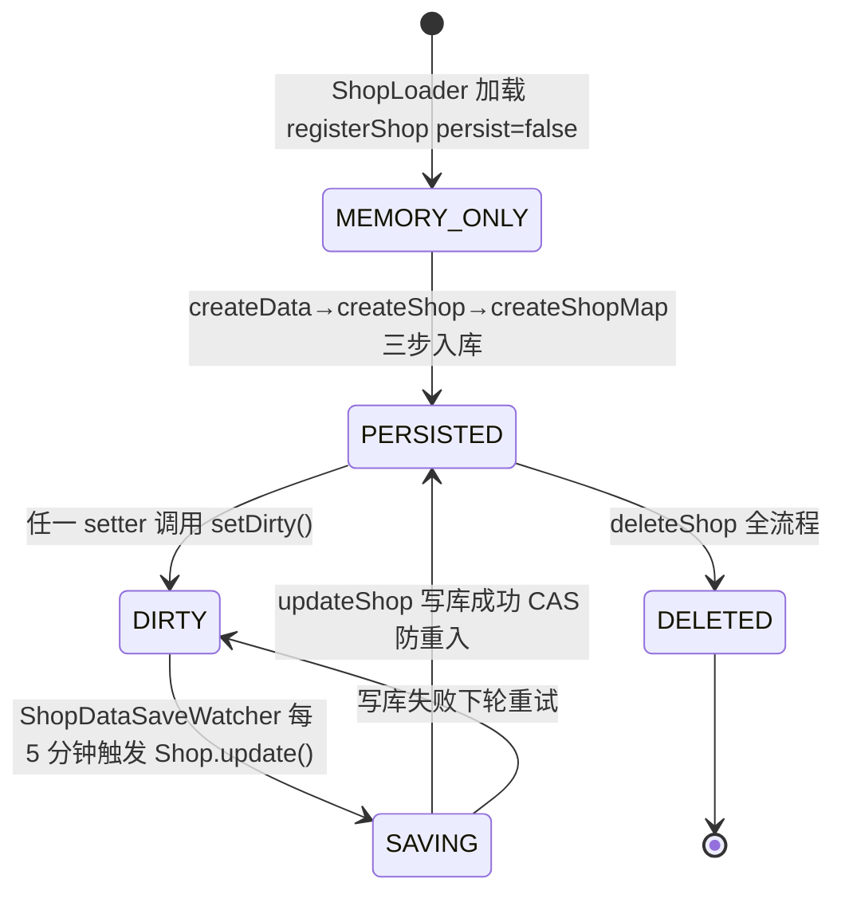

### 8.3 区块级加载/卸载（isLoaded）

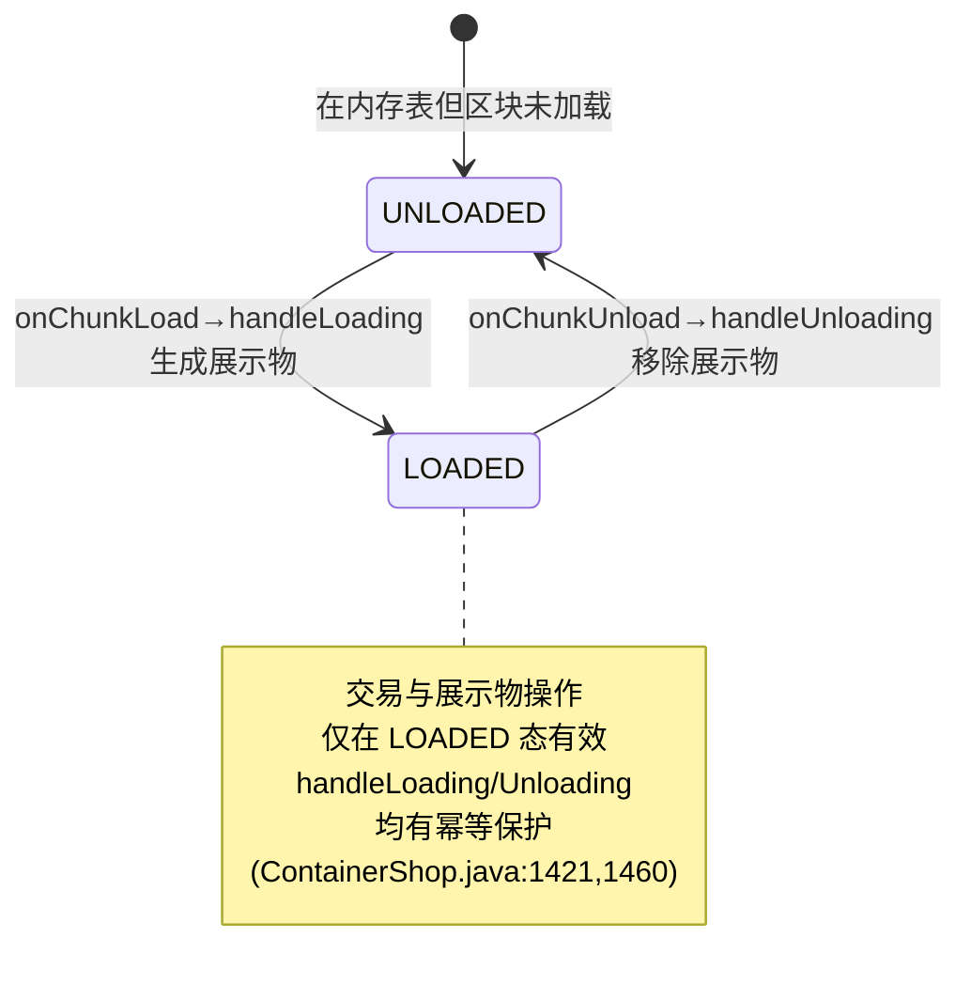

---

## 9. onDisable() 关停序列（QuickShop.java:1241-1328）

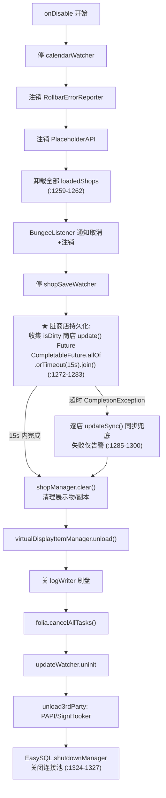

---

## 10. 线程模型全景

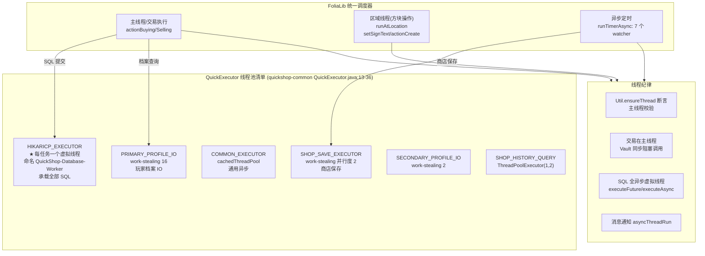

**要点**：SQL 全部跑在 Java 21 虚拟线程上（QuickExecutor.java:33-36）；交易（经济+库存）在主线程同步完成保证原子性；方块相关操作经 FoliaLib `runAtLocation` 调度到正确区域线程。

---

## 11. 定时任务清单（watcher/）

| Watcher | 周期 | 线程 | 职责 | 证据 |
|---|---|---|---|---|
| ShopDataSaveWatcher | 5 分钟 | 异步 | 扫描 isDirty 商店批量落库，saveTask.isDone() 防重入 | QuickShop.java:844-845 |
| SignUpdateWatcher | 10 tick | 异步 | 队列刷新木牌文本，单次限时 50ms 防卡顿 | QuickShop.java:1122 |
| LogWatcher | 10 tick | 异步 | 内存日志队列刷 qs.log，超 file-size MB gzip 轮转 | QuickShop.java:1123-1125 |
| CalendarWatcher | 1 秒 | 异步→主线程 | 检测跨秒/分/时/日/周/月/年发 CalendarEvent，≥HOUR 才落盘缓存 | QuickShop.java:1121-1129 |
| OngoingFeeWatcher | 配置 ticks | 异步→主线程交易 | 向店主收持续费用，余额不足删店 | QuickShop.java:1227-1239 |
| DisplayAutoDespawnWatcher | 配置 checkTime | **主线程** | 按玩家距离动态生成/移除展示物 | QuickShop.java:981-984 |
| UpdateWatcher | 1 小时 | 异步 | 检查更新，通知 quickshop.alerts 权限玩家 | UpdateWatcher.java:26-38 |

---

## 12. 生命周期钩子链（Bukkit 事件 → QuickShop 内部）

| 钩子 | 注册顺序 | 处理逻辑 | 代码位置 |
|---|---|---|---|
| onLoad | 1st | libby→平台→QuickShop.onLoad 13 步 | QuickShopBukkit.java:56-76 |
| onEnable | 2nd | 冲突检查→QuickShop.onEnable 42 步 | QuickShopBukkit.java:96-110 |
| ServiceRegisterEvent | 运行时 | 经济 provider 热插拔重载 | VaultProvider.java:316-332 |
| PluginEnableEvent | 运行时 | 经济缺失时重试装载 | EconomySetupListener.java:16-21 |
| QSConfigurationReloadEvent | reload 时 | compat 模块自动 reloadConfig+init | CompatibilityModule.java:97-103 |
| onDisable | last | 14 步关停+15s 超时兜底保存 | QuickShop.java:1241-1328 |

---

## 13. 错误处理与容错总表

| 流程步骤 | 可能失败点 | 处理方式 | 恢复策略 | 代码位置 |
|---------|-----------|---------|---------|---------|
| libby 装库 | 网络不可达 | IllegalStateException | 首次安装需联网，之后走本地 lib/ | QuickShopBukkit.java:222-223 |
| 平台检测 | Spigot/未知 | 抛异常禁插件 | 引导用户换 Paper | QuickShopBukkit.java:243-258 |
| 环境自检 | 版本/依赖不符 | BootError 优雅降级 | 保留 /qs paste 诊断 | QuickShop.java:469-480 |
| 数据库连接 | 连接失败 | bootError=databaseError | 禁用插件提示检查配置 | QuickShop.java:1205-1211 |
| 库存交易 | 背包满/物品不匹配 | failSafeCommit→rollback | LIFO 快照恢复 | SimpleInventoryTransaction.java:154-221 |
| 经济交易 | 余额不足/provider异常 | safeCommit→rollback | LIFO 反向操作补偿 | QSEconomyTransaction.java:370-379 |
| 商店保存 | SQL 失败 | 留 dirty 下轮重试 | 5 分钟 watcher 兜底 | ShopDataSaveWatcher.java:29-37 |
| 关服保存 | 15s 超时 | 逐店 updateSync | 同步兜底+告警 ID/位置 | QuickShop.java:1285-1300 |
| 建店费用 | 扣费失败 | 不建店 | safeCommit 保证不丢钱 | SimpleShopManager.java:823-835 |
| 容器消失 | getInventory==null | 删除或卸载商店 | delete-corrupt-shops 配置 | ContainerShop.java:1426-1436 |
| 错误上报 | 主线程异常 | 拒绝上报+去重 | 隐私审查后 Rollbar | RollbarErrorReporter.java:68-140 |

**缺乏容错标记**：经济交易的两段提交中「库存已过户但经济失败」路径仅靠日志提示回滚风险（SimpleShopManager.java:659-667），无自动逆向库存过户——依赖 failSafeCommit 之后的 safeCommit 顺序设计（库存先失败则不会动钱；钱失败时库存已过户需人工介入），是已知架构权衡。
