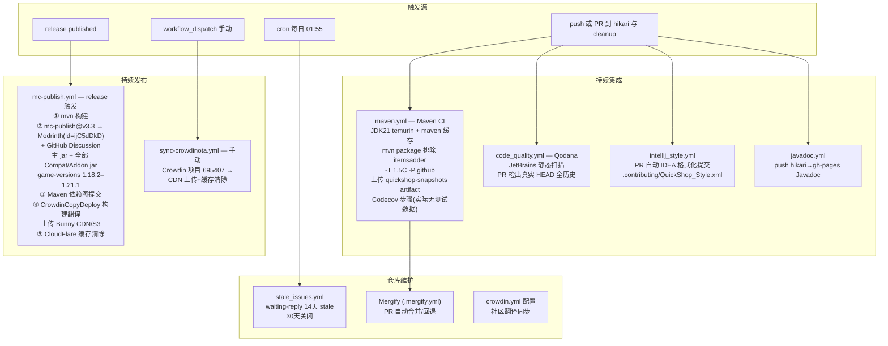
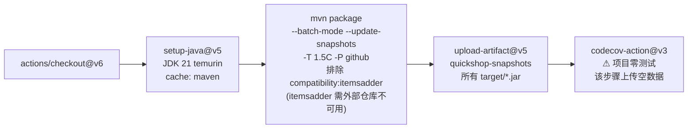
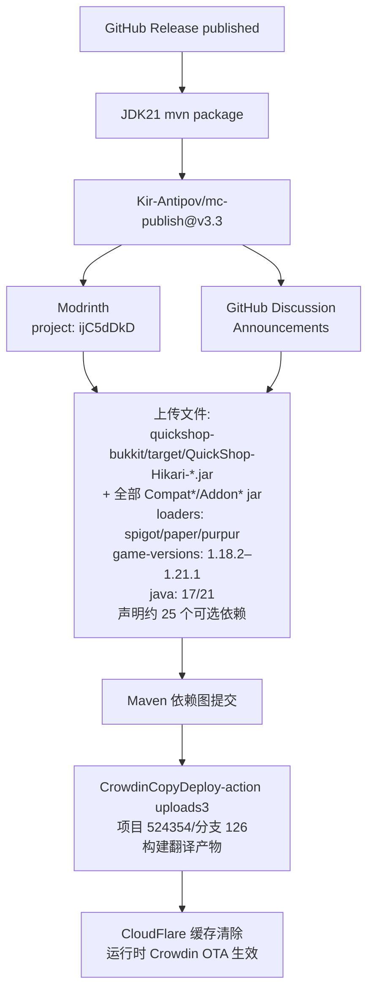
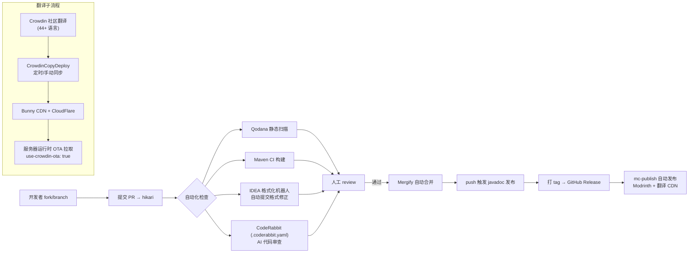
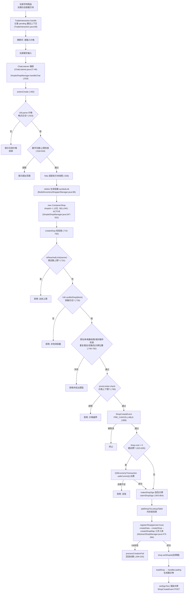
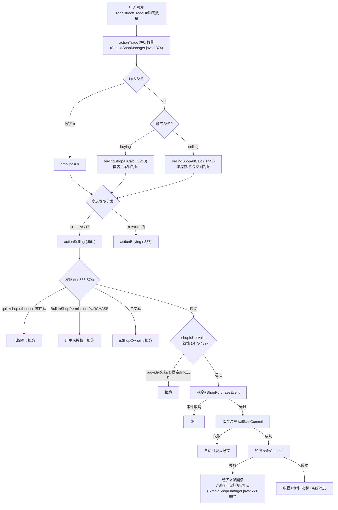
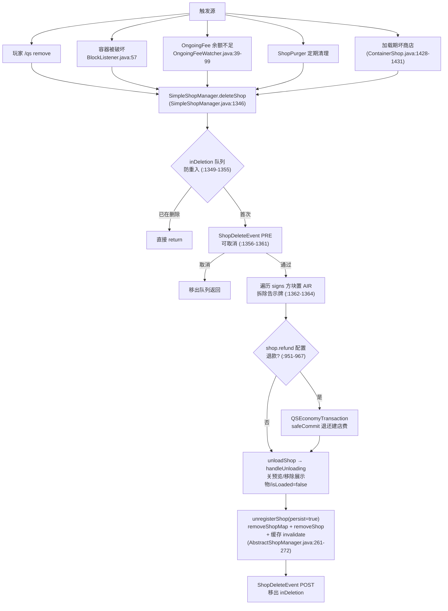
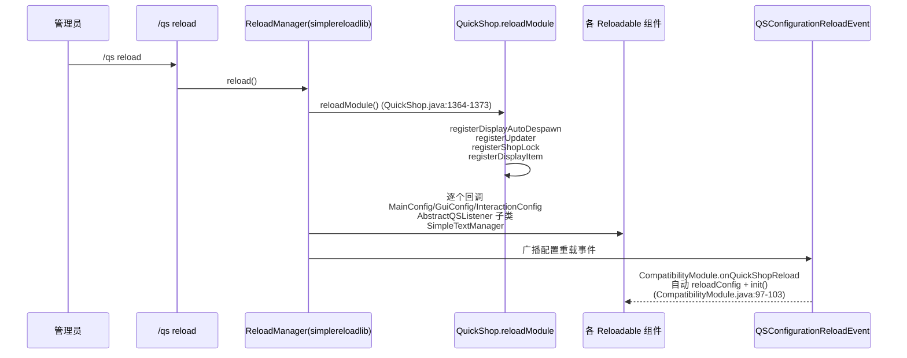
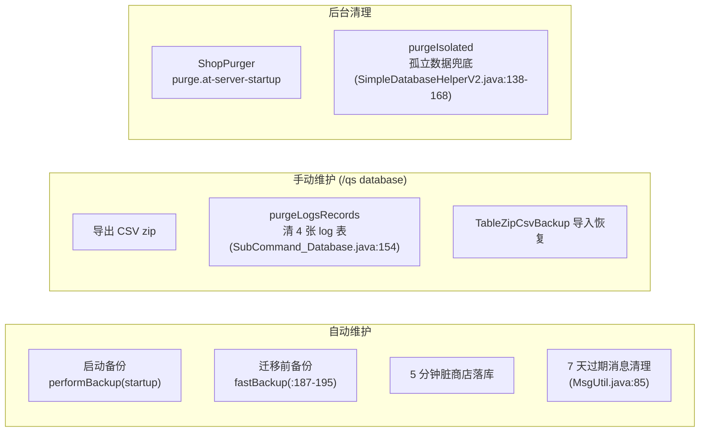

# QuickShop-Hikari 工作流分析报告

> 生成自 codebase-analyzer｜分析时间：2026-08-16
> 路径缩写：`QS/` = `quickshop-bukkit/src/main/java/com/ghostchu/quickshop/`。

---

## 1. CI/CD 管线全景

项目使用 GitHub Actions（7 个工作流，.github/workflows/），覆盖构建→质检→发布→翻译分发→仓库维护全链路：

### 1.1 maven.yml 构建流水线细节

证据：.github/workflows/maven.yml:6-33；排除 itemsadder 的原因见 maven.yml:24 注释与 pom.xml:508（itemsadder 依赖无 Maven 仓库）。

### 1.2 mc-publish.yml 发布流水线（release 触发）

证据：mc-publish.yml:29-99；运行时侧 SimpleTextManager.java:98（crowdinHost=`https://qshikari.b-cdn.net`）与 :79（拉取路径 `/hikari/crowdin/lang/%locale%/messages.yml`）构成「发布→CDN→服务器 OTA 拉取」闭环。

---

## 2. 开发协作工作流

---

## 3. 核心业务工作流一：商店创建（含完整决策树）

参与者：玩家、QuickShop、经济系统（Vault）、保护插件（兼容模块）、数据库。

**业务规则量化**（从 config.yml 与代码提取）：
- 建店费用：`shop.cost`（默认 0）
- 商店数上限：`limits.ranks` 按权限组（QuickShop.java:837 SimpleRankLimiter）
- 价格限制：`price-min`/`price-max`/`whole-number-prices` 等（SimplePriceLimiter）
- 双箱规则：非店主点击双箱强制选中另一半（PlayerListener.java:157-170）

---

## 4. 核心业务工作流二：交易执行决策树

---

## 5. 核心业务工作流三：商店删除

---

## 6. 配置热重载工作流

---

## 7. 数据库维护工作流

---

## 8. 异常恢复路径汇总

| 工作流 | 失败点 | 恢复机制 | 自动/手动 | 证据 |
|---|---|---|---|---|
| 启动-装库 | 无网络 | 本地 lib/ 缓存复用 | 自动 | QuickShopBukkit.java:137 |
| 启动-数据库 | 连接失败 | BootError + 禁用插件 | 手动修配置 | QuickShop.java:1205-1211 |
| 启动-经济 | Vault 未就绪 | 延迟 1tick + PluginEnableEvent 重试 | 自动 | QuickShop.java:869；EconomySetupListener.java:16-21 |
| 交易-库存 | 背包满/不匹配 | failSafeCommit LIFO 回滚 | 自动 | SimpleInventoryTransaction.java:154-221 |
| 交易-经济 | 余额不足/异常 | safeCommit 反向补偿 | 自动 | QSEconomyTransaction.java:370-379 |
| 保存-SQL | 写库失败 | dirty 保留下轮重试 | 自动(5min) | ShopDataSaveWatcher.java:29-37 |
| 关服-保存 | 15s 超时 | 逐店同步 updateSync | 自动+告警 | QuickShop.java:1285-1300 |
| 加载-坏商店 | 容器消失 | 删除或跳过待区块 | 配置决定 | ShopLoader.java:131-136 |
| 世界卸载 | 引用悬空 | unload 全部该世界商店 | 自动 | WorldListener.java:80-99 |
| 兼容模块 | 旗标冲突 | 复用已有 flag 或禁用自身 | 自动 | worldguard/Main.java onLoad |
| 更新检查 | API 不可达 | 1h 缓存重试 | 自动 | UpdateManager.java:60,116 |

**标记「缺乏容错」**：① 库存过户成功但经济提交失败时无自动逆向库存（见 §4 决策树 O1 分支）；② `checkTax` 正数税额不入账的疑似缺陷（QSEconomyTransaction.java:462-464）意味着税收审计依赖 qs_log_transaction 而非真实入账。

---

## 9. 测试策略现状

| 维度 | 现状 |
|---|---|
| 单元测试 | **0 个**（全仓库无 @Test/junit import） |
| 集成测试 | 无 |
| E2E 测试 | 无 |
| 覆盖率 | maven.yml:30-33 有 Codecov 步骤但无 surefire/jacoco 配置，上传的是空数据 |
| 替代质量手段 | Qodana 静态扫描（code_quality.yml）+ CodeRabbit AI 审查（.coderabbit.yaml）+ 社区实测 |

> 结论：质量保障完全依赖静态分析 + 人工 review + 社区运行反馈。对交易/经济这类资金敏感路径，这是显著风险（04 报告将「为交易核心补测试」列为 AI 辅助高优先级建议）。

---

## 10. 工作流总结

1. **发布链路高度自动化**：tag→Release→Modrinth 多 artifact 发布→翻译 CDN 推送→缓存清除，一条 release 流水线全部完成（mc-publish.yml:29-99）。
2. **翻译是独立生产线**：Crowdin(社区)→CopyDeploy(CI)→Bunny CDN→运行时 OTA（SimpleTextManager.java:99-108），翻译更新无需发版。
3. **业务工作流的防御性设计一致**：所有资金路径统一 safeCommit、所有创建路径先 PRE 事件后落库、所有删除防重入。
4. **最大缺口是测试**：7 条 CI 工作流无一运行测试，建议优先为 QSEconomyTransaction/SimpleInventoryTransaction/SimpleShopManager 三条资金链补 JUnit 测试。
