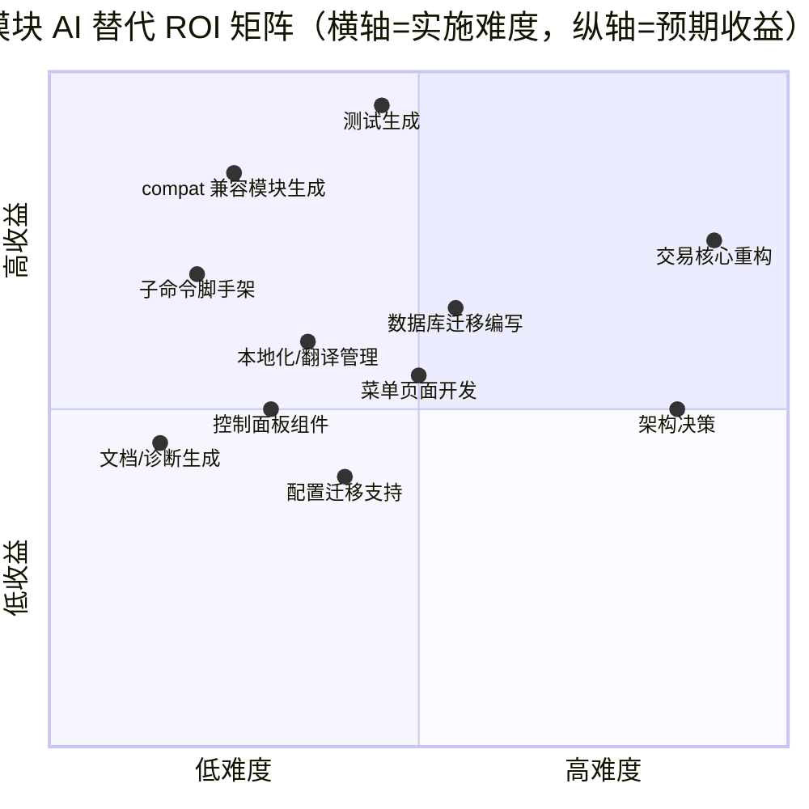
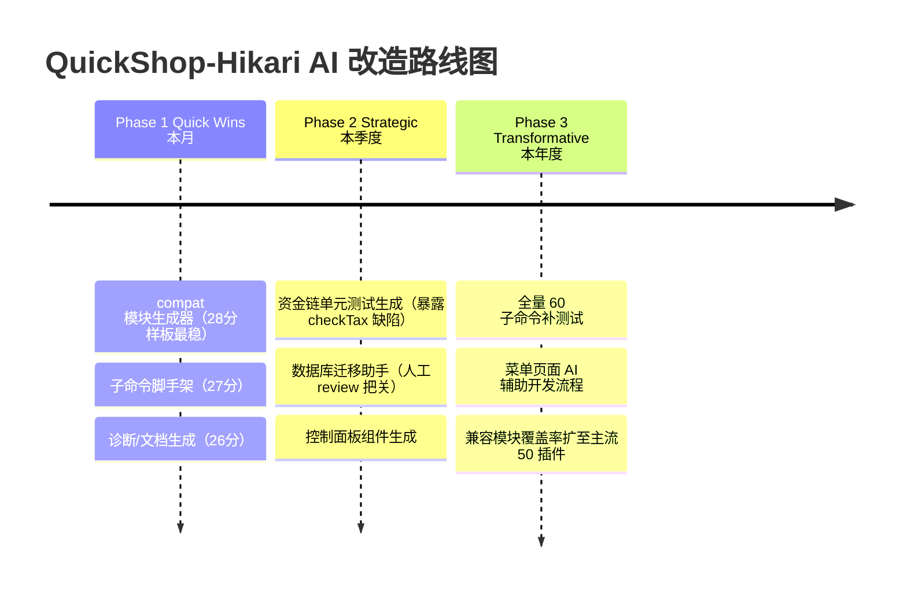

# QuickShop-Hikari AI 工作流替代方案报告

> 生成自 codebase-analyzer｜分析时间：2026-08-16
> 路径缩写：`QS/` = `quickshop-bukkit/src/main/java/com/ghostchu/quickshop/`，`API/` = `quickshop-api/src/main/java/com/ghostchu/quickshop/api/`。
> 评估基于静态代码分析；评分 1-5（分越高越适合 AI），总分 30。

---

## 1. 模块级 AI 替代可行性评估



### 1.1 评分总表

| # | 模块 | 确定性 | 输入结构化 | 安全风险(高=安全) | 领域复杂度(高=简单) | 上下文需求(高=局部) | 重复性 | 总分 | 等级 |
|---|------|--------|-----------|------------------|--------------------|--------------------|--------|------|------|
| 1 | **compatibility/* 兼容模块**（30 个既有样板） | 5 | 5 | 4 | 4 | 5 | 5 | **28** | 🤖 完全 AI 化 |
| 2 | **子命令脚手架**（subcommand/ 60 个） | 5 | 5 | 4 | 4 | 5 | 4 | **27** | 🤖 完全 AI 化 |
| 3 | **诊断/文档生成**（paste、javadoc 补充） | 4 | 4 | 5 | 4 | 5 | 4 | **26** | 🤖 完全 AI 化 |
| 4 | **控制面板组件**（controlpanel/component 12 个） | 4 | 5 | 4 | 3 | 5 | 4 | **25** | 🤖 完全 AI 化 |
| 5 | **本地化管理**（messages.yml 键维护） | 4 | 4 | 4 | 4 | 4 | 4 | **24** | 🤖 完全 AI 化 |
| 6 | **单元测试生成**（当前 0 覆盖） | 3 | 4 | 4 | 3 | 3 | 5 | **22** | 🧑‍💻 AI 辅助 |
| 7 | **数据库迁移编写**（DatabaseUpgrade 链） | 3 | 4 | 2 | 3 | 3 | 3 | **18** | 🧑‍💻 AI 辅助 |
| 8 | **菜单页面开发**（MenuCore 页面） | 3 | 3 | 4 | 2 | 3 | 3 | **18** | 🧑‍💻 AI 辅助 |
| 9 | **addon 功能模块**（如 discount） | 3 | 3 | 3 | 2 | 2 | 3 | **16** | 🧑‍💻 AI 辅助 |
| 10 | **配置迁移/版本支持** | 3 | 3 | 3 | 2 | 3 | 2 | **16** | 🧑‍💻 AI 辅助 |
| 11 | **交易核心逻辑**（actionSelling 等） | 2 | 2 | 1 | 1 | 1 | 2 | **9** | 👤 人工主导 |
| 12 | **架构决策/并发模型** | 1 | 1 | 1 | 1 | 1 | 1 | **6** | 👤 人工主导 |

---

## 2. 完全 AI 化模块的函数级下钻

### 2.1 兼容模块（compatibility/*）— 最佳候选

**模式证据**：30 个模块全部继承同一基类，单文件为主（worldguard/Main.java 仅 225 行），结构高度模板化。

**基类接口契约**（compatibility/common/.../CompatibilityModule.java:26-112）：

| 方法 | 签名 | 职责 | AI 可生成度 |
|---|---|---|---|
| `init()` | `abstract void` | 子类必须实现：读配置、注册第三方监听 | 完全——按目标插件 API 文档生成 |
| `onLoad()` | `@Override void` | saveDefaultConfig + 取 QuickShopAPI（:64-73） | 基类提供，通常只需 super.onLoad() |
| `onEnable()` | `@Override void` | registerEvents + init（:82-93） | 模板固定 |
| `getShops(world,minX,minZ,maxX,maxZ)` | `List<Shop>` | 区块迭代+BBox 过滤（:35-48） | 基类提供 |
| `recordDeletion(qUser,shop,reason)` | `void` | 记录删除审计日志（:105-111） | 基类提供 |

**典型子类必须实现的三个集成点**（以 worldguard 为例）：
1. `onLoad()` 注册第三方旗标/钩子（worldguard/Main.java onLoad：注册 `quickshophikari-create`/`quickshophikari-trade` StateFlag，含 FlagConflictException 回退）
2. 监听 QuickShop 事件做拦截：`ShopCreateEvent`/`ShopPermissionCheckEvent`/`ShopPurchaseEvent`
3. 实现 `init()` 读自身 config.yml

**新模块 Maven 脚手架固定项**：pom.xml（依赖 quickshop-api + compat-common + 目标插件 provided）、plugin.yml（depend 目标插件 + softdepend QuickShop-Hikari）、根 pom.xml `<modules>` 注册、mc-publish.yml 上传列表登记（:35-76）。

**复杂度评估**：圈复杂度低（worldguard Main ≈ 每方法 2-4 分支）；外部依赖单一（目标插件 API）；副作用仅事件取消。**→ 生成 Blueprint `01-compat-module-generator.md`**

### 2.2 子命令脚手架（command/subcommand/）

60 个子命令全部实现 `CommandHandler<PlayerCommandSender>` 泛型接口：

| 方法 | 契约 | 证据模式 |
|---|---|---|
| `onCommand(sender, commandParser)` | 权限已由 SimpleCommandManager 统一检查（:591-599），子命令只写业务 | SubCommand_SilentBuy.java:31 |
| `onTabComplete(sender, commandParser)` | 返回补全列表 | SubCommand_ROOT.java:36-60 |
| 注册 | SimpleCommandManager.registerCmd(CommandContainer.builder()...) | SimpleCommandManager.java:121-529 |

**函数清单与 AI 潜力（节选）**：

| 子命令 | 位置 | 行数级 | 逻辑模式 | AI 替代潜力 |
|---|---|---|---|---|
| SubCommand_About | :281 | ~40 行 | 纯文本输出 | 完全 AI 化 |
| SubCommand_Help | :121 | ~80 行 | 列表+分页 | 完全 AI 化 |
| SubCommand_Price | :210 | ~100 行 | 找店→校验→setPrice 三阶段事件 | 完全 AI 化 |
| SubCommand_SilentBuy | silent/ | ~40 行 | runtimeUUID→找店→改类型 | 完全 AI 化（模板极稳） |
| SubCommand_Remove | :216 | ~120 行 | 找店→confirm→deleteShop | AI 辅助（需防误删） |
| SubCommand_Database | :437 | ~300 行 | 多子操作+SQL | AI 辅助 |

**→ 生成 Blueprint `02-subcommand-scaffold.md`**

### 2.3 控制面板组件（shop/controlpanel/component/）

12 个组件全部实现 `ControlComponent`：`generate(componentHolder, player)` 产出按钮 + `getClickType()`。新增组件（如「设置商店开放时间」）是纯模式化扩展：一个类 + generate 生成 silent 命令字符串。ShopModeComponent.java:77-98 展示了完整模式（generate → `/qs silentbuy {runtimeUUID}` 命令）。**AI 可完全生成**。

### 2.4 本地化管理（localization/）

- 键值结构固定：`messages.yml` 嵌套 YAML → `text().of(sender, key, args...)` 消费（SimpleTextManager.java:919）
- 硬编码 fallback en_us（:253-269）
- AI 适合：新键补全全语言、旧键清理、Crowdin 同步前 diff 检查。**→ Blueprint `04-localization-manager.md`**

---

## 3. AI 辅助模块（需人工审核点）

### 3.1 单元测试生成 — 最高战略价值

当前 0 测试 + 资金敏感路径。AI 可生成的测试目标（按风险排序）：

| 测试目标 | 关键断言点 | 人工审核点 |
|---|---|---|
| `QSEconomyTransaction` 税计算 | amountAfterTax/fromAmount/totalTax 边界（0%/100%/负税） | **checkTax 疑似缺陷（:462-464）** — AI 写测试会暴露它，需人判断语义 |
| `QSEconomyTransaction.rollback` | LIFO 顺序、跳过未提交/已回滚操作（:489-527） | 回滚失败 continueOnFail 语义 |
| `SimpleInventoryTransaction` | commit 成功/中途失败恢复快照（:69-221） | Bukkit Inventory mock 的真实性 |
| `SimplePriceLimiter` | min/max/整数价边界 | 配置组合覆盖 |
| `ShopLoader.loadSingleShop` | 坏数据容错分支（:251-278） | DB mock（可用 H2 内存库） |
| `QuickShopTagManager` | 标签增删查、权限过滤 | 无 |

**前置条件契约（AI 生成测试所需 context）**：JDK21 + JUnit5 + mockito；H2 MODE=MYSQL 内存库做 DAO 层集成测试完全可行（项目已依赖 H2）。

### 3.2 数据库迁移编写（DatabaseUpgrade）

每次 schema 变更 = 版本 N→N+1 一个方法 + DataTables 枚举同步 + LATEST_DATABASE_VERSION 递增（SimpleDatabaseHelperV2.java:60）。模式固定但**安全风险 2 分**（迁移错误毁库），必须人工 review + 保留 fastBackup 步骤。**→ Blueprint `03-database-migration-author.md`**

### 3.3 菜单页面开发（MenuCore）

外部库 net.tnemc.menu 的 Page/IconBuilder API，QuickShopPage 基类提供 i18n 快捷方法（QuickShopPage.java:44）。AI 辅助可写 70%：页面骨架+图标布局+分页；人工处理交互细节与 MenuCore 版本兼容（CustomInventoryListener.java:46-58 还在给 MenuCore 的 6 秒点击封锁打补丁，说明该库行为有坑）。

---

## 4. 人工主导模块（AI 仅参考）

| 模块 | 原因 | AI 可提供的参考价值 |
|---|---|---|
| 交易核心（actionSelling/actionBuying） | 资金安全 1 分；两段提交顺序是架构权衡（先库存后经济）；Folia 线程约束 | 生成调用链文档、标注风险点（如 02 报告 §7.4 缺陷） |
| 并发模型（QuickExecutor/FoliaLib 调度） | 跨线程一致性需要领域专家判断 | 梳理线程边界表 |
| API 契约变更（quickshop-api） | 影响全部下游 fork/addon | 生成兼容性 diff 报告 |

---

## 5. 接口契约提取（供 Blueprint 使用的核心契约）

### 5.1 `ContainerShop.update()` 契约（AI 写测试/重构时必读）

```yaml
签名: CompletableFuture<Void> update()   # ContainerShop.java:1852-1893
前置条件:
  - shopId != -1（已持久化）
  - 未在 updatingAtomic CAS 中（:1876-1878 防重入）
后置条件:
  - isDirty() 恢复 false
  - qs_data 行按 generateLookupParams 查重复用或新建（SimpleDatabaseHelperV2.java:921-941）
  - ShopDatabaseEvent PRE→POST 已触发（:1864-1873）
不变式:
  - data 行查重排除 create_time 字段
错误场景:
  - SQL 失败 → dirty 保持 true，下个 5min 周期重试
  - 关服超时 15s → updateSync 同步兜底（QuickShop.java:1285-1300）
```

### 5.2 `QSEconomyTransaction.safeCommit()` 契约

```yaml
签名: boolean safeCommit()   # QSEconomyTransaction.java:370-379
前置条件:
  - 构造期 EconomyTransactionEvent 未取消交易
  - from 账户 balance >= fromAmount（completable() 预检 :340）
后置条件(成功):
  - from 减少 fromAmount
  - to 收到 amountAfterTax（有分成时先按比例分配）
  - processingStack 清空（逻辑上）
后置条件(失败):
  - 所有已 commit 的操作被 LIFO 反向补偿
错误场景:
  - 余额不足 → "From has insufficient funds." → onFailed
  - 插件回调取消 → 终止（⚠ 未调 onFailed :393-397）
  - 税收入账失败 → onTaxFailed 但主交易不回滚
已知疑似缺陷:
  - checkTax 守卫 if(totalTax > 0) return（:464）——正税额不入账
```

### 5.3 上下文需求清单（创建 AI Skill 所需）

| 依赖类型 | 内容 | 来源 |
|---|---|---|
| 数据模型 | Shop/ShopManager/EconomyProvider 接口 | API/shop/、API/economy/ |
| 事件清单 | 40+ 三阶段事件 | API/event/ |
| 基类模板 | CompatibilityModule / AbstractQSListener / QuickShopPage / ControlComponent | 各基类文件 |
| 注册点 | SimpleCommandManager.java:121-529 / QuickShop.java registerListeners / 根 pom modules | — |
| 配置键 | config.yml 全部节点 | quickshop-bukkit/src/main/resources/config.yml |
| 文本键 | messages.yml 嵌套结构 | 同目录 |
| 既有范例 | worldguard(Main.java)/discount(addon)/SubCommand_SilentBuy | 最佳少样本示例 |

---

## 6. AI 改造路线图



### 优先级矩阵

| 象限 | 项目 | 动作 |
|---|---|---|
| 🥇 高收益+低难度 | compat 模块生成、子命令脚手架、测试生成 | 立即实施 |
| 🥈 高收益+高难度 | 交易核心测试化、迁移助手 | 规划实施（先建 H2 测试基建） |
| 🥉 低收益+低难度 | 文档/诊断、控制面板组件 | 逐步推进 |
| 📋 低收益+高难度 | 交易核心 AI 重写 | 暂时搁置（人工主导） |

---

## 7. 风险与限制

1. **资金路径零容错 AI 化**：经济/库存核心不接受 AI 直接修改——任何变更必须人工 review + 测试覆盖。
2. **零测试基线**：AI 生成代码无回归网兜底，Phase 1 的 AI 生成物也建议先补对应测试再合入。
3. **Folia 线程语义**：AI 生成的任何涉及方块/Bukkit API 的代码必须过 `Util.ensureThread` 与 `folia.getScheduler()` 纪律检查（02 报告 §10）。
4. **外部 API 版本漂移**：compat 生成器依赖目标插件 API 文档的时效性，需联网校验最新 API（如 Lands 7.x vs 旧版）。
