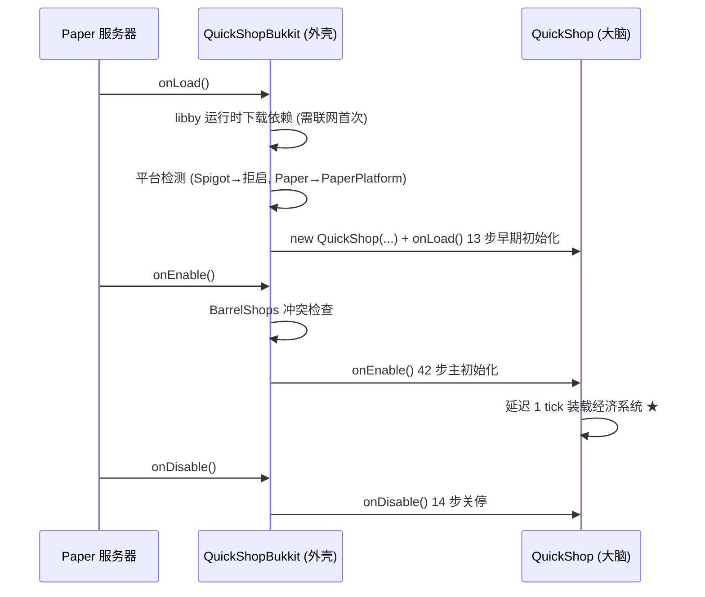
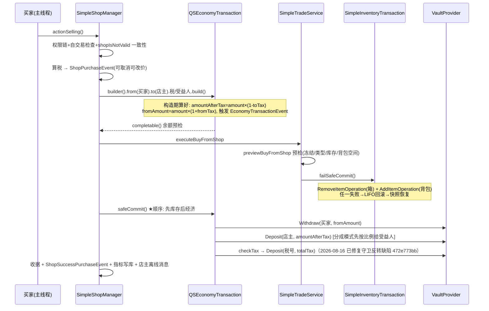

# 02 · 运行原理

> 路径缩写：`QS/` = `quickshop-bukkit/src/main/java/com/ghostchu/quickshop/`

## 1. 双阶段引导（胖壳 + 大脑）



**经济为何延迟 1 tick**（QuickShop.java:869）：给 Vault 等经济插件注册 ServicesManager 的时间窗口；`EconomySetupListener` 还监听 PluginEnableEvent 随时重试，双保险。

### onLoad 13 步要点（QuickShop.java:403-435）
单例赋值 → 注册 ServicesManager → initConfiguration → 热重载注册 → **runtimeCheck 环境自检**（失败走 BootError 优雅降级而非崩溃）→ PrivacyController → RegistryManager → MetricManager → FastPlayerFinder → **loadTextManager（失败直接禁插件）** → InventoryWrapperRegistry。

### onEnable 42 步分四阶段
1. **调度器与菜单**：FoliaLib → 按服务器类型选 Folia/Paper/Bukkit 的 Chat/Click/Close 监听与 MenuHandler → 注册 5 个菜单。
2. **自检与基础设施**：runtimeCheck → Rollbar 错误上报 → ItemMatcher 三选一 → **initDatabase** → 用户名缓存异步预热。
3. **领域装配**：权限 → 命令管理器(60 子命令) → SimpleShopManager → 保存/木牌 watcher → **ShopLoader.loadShops()** → 交互管理器 → 15 监听器 → 控制面板 → 展示物保护。
4. **延迟任务与集成**：经济延迟装载 → 5 个周期任务 → Bungee 频道 → PAPI → 3rdParty hook。

## 2. 数据库初始化（QuickShop.java:1162-1212）

- HikariUtil 读 config.yml 的 database.properties 全透传 HikariCP。
- `database.mysql=true` → MySQL；否则 H2 + `SET MODE=MYSQL` 兼容模式。
- SQLManagerImpl 的执行器池 = **每任务一个虚拟线程**（QuickShop-Database-Worker-N）。
- `SimpleDatabaseHelperV2` 构造链：checkTables → checkColumns → checkDatabaseVersion → 启动备份（CSV→zip）。
- **版本 >20 直接抛 IllegalStateException 拒绝启动**（防降级毁库）；全新库直接写 20。
- 迁移链每步前 `fastBackup()`；链路：v9 清孤立数据 → v10 benefit 列 → v11 cachedName → v12 UUID 扩容 → v13 utf8mb4 → v14 world 扩 255 → v15 索引 → v16 强制 zip 备份 → v19 encoded 列 → v20 shop_state 列。

## 3. 商店加载（ShopLoader.java）

1. `listShops` 三表 INNER JOIN（data⋈shops⋈shop_map）取全量。
2. 逐条 `supplyAsync(workStealingPool)` 并行反序列化（DataRawDatabaseInfo：shopType/shopState/物品 platform.decodeStack 优先/permissions JSON/extra YAML）。
3. 世界/区块已加载 → 主线程统一 loadShop；未加载 → 等 ChunkListener 的 onChunkLoad。
4. `handleLoading()`：容器丢失时按 `delete-corrupt-shops` 配置删店或卸载；ShopLoadEvent(可取消) → isLoaded=true → checkDisplay() 生成展示物 → 刷木牌。
5. 注册进内存查找表 `Map<world, Map<ShopChunk, Map<Location, Shop>>>`（persist=false，数据本来就在库里）。

**脏标记持久化**：任一 setter 置 dirty → ShopDataSaveWatcher 每 5 分钟批量 update()；写库失败保留 dirty 下轮重试。

## 4. 核心数据路径：购买交易（actionSelling）

买家从 SELLING 店购买（店主视角=卖出）的完整时序：



**数值例**（64 钻石 @10 元，税率 5%）：amount=640 → amountAfterTax=608 → toTax=32 → fromTax=0 时买家付 640；审计记录 qs_log_purchase(money=640, tax=32)。

**两段式顺序的架构权衡**：库存先过户、后转钱。库存失败→不动钱（安全）；**钱失败→库存已过户，仅日志告警，无自动逆向**（SimpleShopManager.java:659-667），依赖 safeCommit 内部补偿把失败概率压到最低。已知边界，改动需慎重。

## 5. 状态机

### 5.1 商店双轴状态（类型 × 运行状态，相互独立）
- 类型轴：SELLING ⇄ BUYING（silentbuy/silentsell 三阶段事件切换）。
- 状态轴：ACTIVE ⇄ FROZEN（freeze 命令）。
- `isFrozen() = shopType.isTradingBlocked() || !shopState.isTradingAllowed()` —— 任一轴冻结即阻断交易。

### 5.2 商店生命周期
`MEMORY_ONLY → PERSISTED(三步入库) → DIRTY → SAVING(5min watcher) → PERSISTED / DELETED`；关停时 15s 超时兜底逐店同步 updateSync。

### 5.3 区块级加载
`UNLOADED ⇄ LOADED`（onChunkLoad→handleLoading 生成展示物 / onChunkUnload→handleUnloading 移除），幂等保护；交易与展示物操作仅在 LOADED 态有效。

### 5.4 经济事务状态机（含缺陷标注）
```
INIT(构造算税) → PRECHECK(safeCommit)
  ├─ 插件取消 → onFailed → return false（2026-08-16 已补回调 e19f7407d）
  ├─ 余额不足 → onFailed → CANCELLED
  └─ WITHDRAWING → DEPOSITING(分成逐受益人) → TAXING
       ├─ totalTax>0 时 deposit 到税号（2026-08-16 已修复守卫反转 472e773bb）
       └─ 税失败仅 onTaxFailed，主交易不回滚
任一步失败 → ROLLBACK_ALL(LIFO 反向补偿) → 返回 false
```

## 6. 线程模型 ★ 改代码必读

| 执行域 | 载体 | 用途 |
|---|---|---|
| 主线程/区域线程 | FoliaLib 调度 | **交易全流程在此同步执行**（Vault 是同步阻塞调用）；方块操作走 runAtLocation 到正确区域线程 |
| 虚拟线程 | HIKARICP_EXECUTOR（每任务一个） | **全部 SQL** |
| work-stealing(2) | SHOP_SAVE_EXECUTOR | 商店保存 |
| cachedThreadPool | COMMON_EXECUTOR | 通用异步（通知等） |
| work-stealing(16/2) | PRIMARY/SECONDARY_PROFILE_IO | 玩家档案 IO |
| 定时 | FoliaLib runTimerAsync | 7 个 watcher |

**纪律**：`Util.ensureThread` 主线程断言；涉及方块/Bukkit API 的新代码必须过 `QuickShop.folia().getScheduler()` 调度，不可直接调主线程 API。

## 7. 周期任务（watcher/）

| Watcher | 周期 | 职责 |
|---|---|---|
| ShopDataSaveWatcher | 5 min | 脏商店批量落库（isDone 防重入） |
| SignUpdateWatcher | 10 tick | 队列刷木牌文本（单次限时 50ms） |
| LogWatcher | 10 tick | 内存日志刷 qs.log，超限 gzip 轮转 |
| CalendarWatcher | 1 s | 跨分/时/日/周/月/年发 CalendarEvent |
| OngoingFeeWatcher | 配置 | 向店主收持续费用，余额不足删店 |
| DisplayAutoDespawnWatcher | 配置 | **主线程**按玩家距离生成/移除展示物 |
| UpdateWatcher | 1 h | 检查更新通知 alerts 权限玩家 |

## 8. 关停序列（QuickShop.java:1241-1328）

停 calendarWatcher → 注销 Rollbar/PAPI → 卸载全部 loaded 商店 → 停保存 watcher → **收集 dirty 商店 Future，allOf().orTimeout(15s).join()** → 超时则逐店 updateSync 同步兜底（失败仅告警店 ID/位置）→ 清内存/展示物 → 关 logWriter → folia.cancelAllTasks() → EasySQL 关连接池。

## 9. 错误处理总表

| 失败点 | 处理 | 恢复 |
|---|---|---|
| libby 无网络 | IllegalStateException | 本地 lib/ 缓存（首次除外） |
| Spigot/未知平台 | 抛异常禁插件 | 换 Paper |
| 环境自检失败 | BootError 优雅降级 | /qs paste 诊断 |
| 数据库连不上 | bootError=databaseError | 禁插件，人工修配置 |
| 库存交易失败 | failSafeCommit→rollback | LIFO+快照自动恢复 |
| 经济交易失败 | safeCommit→rollback | LIFO 反向补偿 |
| 保存 SQL 失败 | 留 dirty | 5 min watcher 兜底 |
| 关服保存超时 | 15s orTimeout | 逐店同步 updateSync |
| 容器消失 | getInventory==null | delete-corrupt-shops 配置决定删/卸载 |
| 经济未就绪 | 延迟 1 tick | PluginEnableEvent 重试装载 |
